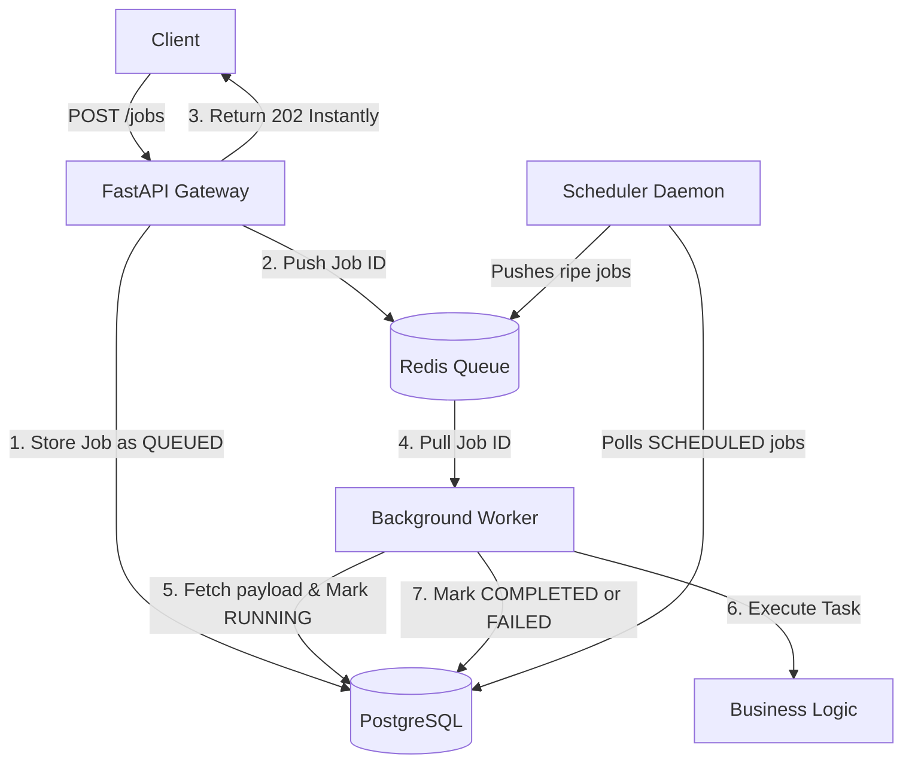
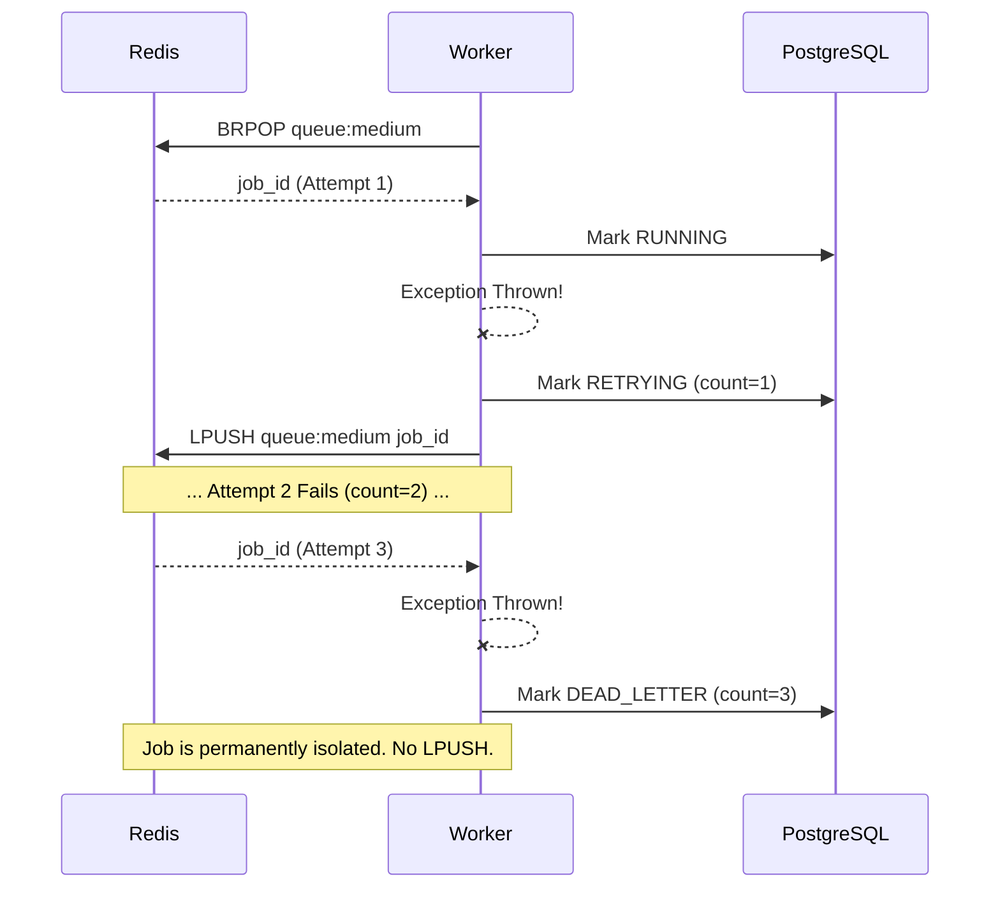

# SENTINELQUEUE v1.0.0

SentinelQueue is a production-grade, distributed background job processing system designed to handle heavy workloads outside of the main HTTP request lifecycle. 

Instead of forcing users to wait for slow processes (like generating a 500-page PDF or training an AI model), the API instantly queues the job and returns a `202 Accepted`. A fleet of background workers handles the heavy lifting asynchronously, while a separate Scheduler daemon manages delayed executions.

## System Architecture



---

## Case Study: Core Design Decisions

If you are reviewing this repository, you might wonder why it was architected this way. Here are the core engineering decisions made to ensure reliability, idempotency, and fault tolerance at scale.

### 1. The "Claim Check" Pattern
**Why push IDs to Redis instead of the full JSON payload?**
Message brokers like Redis are incredibly fast but have limited memory. If a user submits a massive job (e.g., a 10MB base64 image payload), pushing that directly into Redis will choke the queue. 
Instead, SentinelQueue uses the **Claim Check Pattern**: 
1. The heavy payload is saved to Postgres (cheap disk storage).
2. Only the lightweight `UUID` is pushed to Redis.
3. The Worker pops the ID and retrieves the heavy payload directly from Postgres.

### 2. Postgres as the Single Source of Truth
**Why use a database at all if we have Redis?**
Redis is ephemeral. If the Redis container crashes or restarts, all data in memory is lost. In SentinelQueue, **PostgreSQL is the absolute source of truth**. Redis is strictly used as an ephemeral routing mechanism. If Redis dies, no jobs are lost. The system can simply rebuild the queue by querying Postgres for all jobs stuck in the `QUEUED` state.

### 3. The Dead Letter Queue (DLQ) Workflow
**How do we prevent a "Poison Pill" from taking down the cluster?**
If a job is fundamentally broken (e.g., a bad payload), a naive worker will crash, the job will go back to the queue, the next worker will crash, and the loop continues until the entire infrastructure halts.
SentinelQueue wraps worker execution in a strict boundary. If a job fails, the `retry_count` is incremented. After 3 strikes, the job is permanently marked as `DEAD_LETTER` and is intentionally *not* pushed back to Redis.



### 4. The Scheduler Daemon
Instead of forcing the API to hold connections open or using complex Redis sorted sets for delayed jobs, we decouple the logic entirely. If a job is submitted with a future `execute_at` timestamp, the API saves it as `SCHEDULED` and ignores Redis. A completely independent Scheduler Daemon wakes up every 10 seconds, queries Postgres for ripe jobs, and pushes them to the queue.

---

## Getting Started

SentinelQueue is fully containerized. You do not need to run the API or Workers manually.

### 1. Boot the Matrix
From the root directory, build and launch the entire stack (PostgreSQL, Redis, API, Worker, Scheduler):
```bash
docker-compose up -d --build
```

### 2. Initialize the Database
On the first boot, you need to construct the tables in PostgreSQL:
```bash
docker-compose exec api python -m app.core.reset_db
```
*(Or run `python -m app.core.reset_db` locally if your virtual environment is active).*

### 3. Submit a Job
Navigate to `http://localhost:8000/docs` in your browser.

**Immediate Job:**
```json
{
  "task_name": "generate_pdf",
  "payload": {"user_id": 123},
  "priority": "medium"
}
```

**Scheduled Job (e.g. 5 minutes from now):**
```json
{
  "task_name": "generate_pdf",
  "payload": {"user_id": 123},
  "priority": "medium",
  "execute_at": "2025-12-01T15:30:00Z"
}
```

### 4. Monitor the System
Check the logs of the background processes to watch the distributed coordination happen in real-time:
```bash
docker logs -f sentinelqueue-worker
docker logs -f sentinelqueue-scheduler
```

---

## Test Suite
To programmatically prove the architecture holds up under failure, the Pytest suite overrides the database with an in-memory SQLite instance and mocks the Redis client. 

Run the tests locally:
```bash
pytest -v
```
The test suite specifically verifies the **Idempotency** and **DLQ routing** by injecting forced failures into the worker.