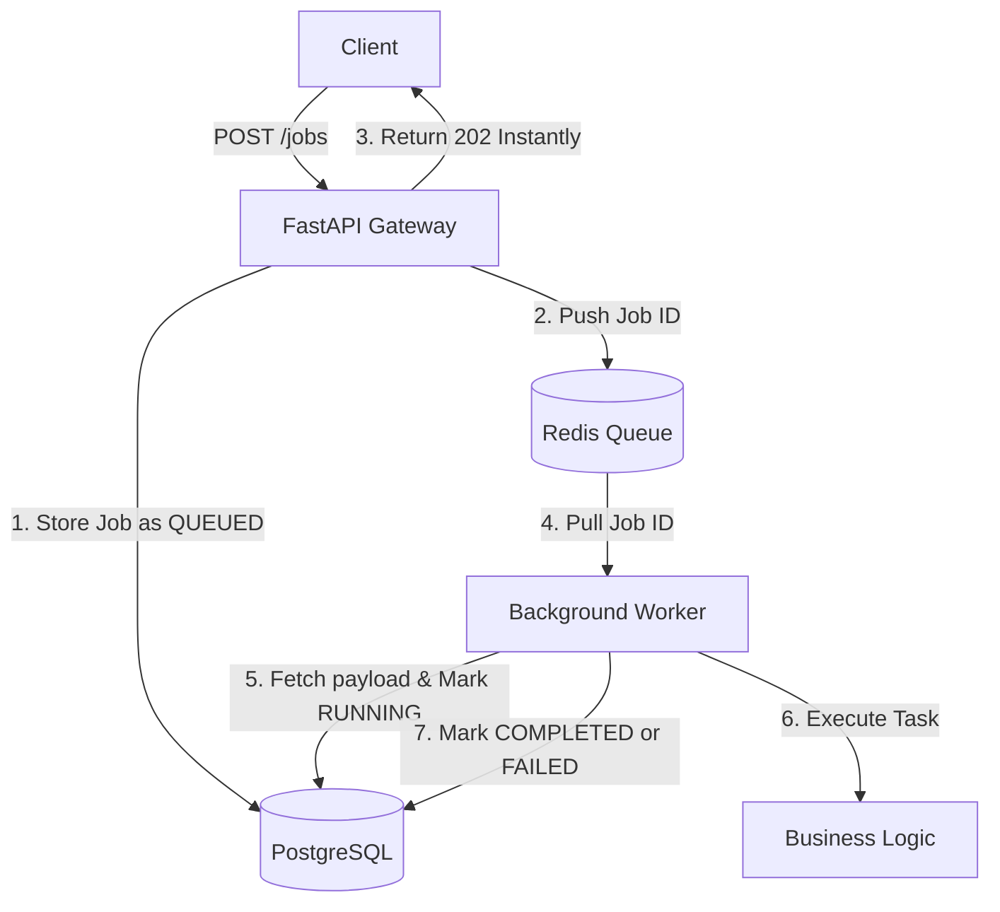

# SENTINELQUEUE

SentinelQueue is a distributed background job processing system designed to handle heavy workloads outside of the main HTTP request lifecycle. 

Instead of forcing users to wait for slow processes (like generating a 500-page PDF or training an AI model), the API instantly queues the job and returns a `202 Accepted`. A fleet of background workers handles the heavy lifting asynchronously.

## Architecture



## Tech Stack
- **API Framework:** FastAPI
- **Database:** PostgreSQL (Source of Truth)
- **Message Broker:** Redis (Ephemeral Queue)
- **ORM & Validation:** SQLAlchemy + Pydantic

## Getting Started

### 1. Infrastructure
You must have Docker Desktop running. Start the required services:
```bash
docker-compose up -d
```
*(This spins up PostgreSQL on port 5440 and Redis on port 6385).*

### 2. Python Environment
Create your virtual environment and install the dependencies:
```bash
python -m venv venv
.\venv\Scripts\activate
pip install -r requirements.txt
```

### 3. Initialize the Database
Before running the system, construct the tables in PostgreSQL:
```bash
python -m app.core.init_db
```

## Testing the System (The Producer-Consumer Pattern)

To see the distributed queue in action, you must run the API and the Worker simultaneously in separate terminal windows.

**Terminal 1 (The Producer / API):**
```bash
uvicorn app.main:app --reload --port 8000
```
Open `http://localhost:8000/docs` in your browser.

**Terminal 2 (The Consumer / Background Worker):**
```bash
python -m app.workers.main
```

### Submit a Job
In the Swagger UI, submit a POST request to `/jobs` with the following payload:
```json
{
  "task_name": "generate_pdf",
  "payload": {
    "user_id": 123
  },
  "priority": "medium"
}
```
Look at Terminal 1: You get an instant response.
Look at Terminal 2: The worker picks up the job, simulates a 5-second process, and completes it.

### Test the Dead Letter Queue (DLQ)
Submit a job designed to fail:
```json
{
  "task_name": "generate_pdf",
  "payload": {
    "force_fail": true
  },
  "priority": "high"
}
```
Watch Terminal 2 as the worker catches the error, retries the job exactly 3 times, and permanently routes it to the Dead Letter Queue.

## Core Concepts Implemented
- **Idempotency**: Workers can safely crash and retry without corrupting the state.
- **Queue Prioritization**: High priority jobs are strictly pulled before Medium or Low.
- **Dead-Letter Queues (DLQ)**: Failing jobs are tracked and eventually isolated to prevent infinite loops.
- **Distributed Coordination**: Workers stamp their `worker_id` on jobs to prevent race conditions.